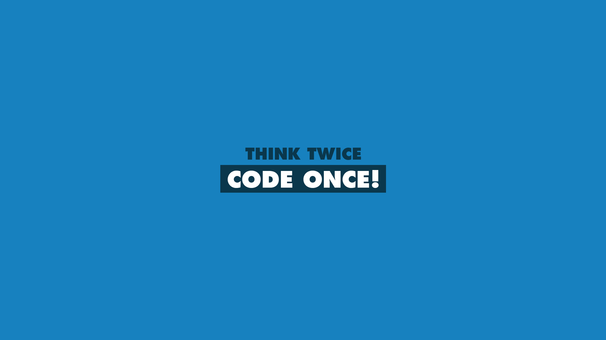

	

<h1 align="center">Think Twice Code Once</h1>

A problem solving technique or approach

প্রোগ্রামিংয়ের জগতে আমরা অনেক  ধরনের সমস্যার সমাধান করে থাকি। যেই এক একটি সমাধান আমাদের দৈন্দিন কাজগুলোকে সহজ করে দেয়।

কিন্তু এই সমস্যাগুলো সমাধান করতে গিয়ে আমরা নিজেরাই আবার নানান রকম  সমস্যায় পড়ি। আচ্ছা! তাহলে আমরা এই যে  নানারকম সমস্যাই পড়ি এটা আসোলে কেন হয়?? অধিকাংশ ক্ষেত্রেই এই ব্যাপারটা ঘটে মূলত আমাদের সমস্যা সমাধানের পন্থা বা প্রব্লেম সলভিং এপ্রোচের জন্যই।

>আমাদের প্রব্লেম সলভিংয়ের  এপ্রোচের উপরই মূলত আমাদের একটি সমস্যা সমাধানের সময়, আমাদের চিন্তা শক্তি  বা থিংকিং ক্যাপাবিলিটি, কোড কোয়ালিটি, ইফিশিয়ান্ট সলিউশনের মত ইত্যাদি গুরুত্বপূর্ণ বিষয় গুলো নির্ভর করে।

একটি সমস্যা সমাধানের পন্থা বা  এপ্রোচ কেমন হলে আমাদের সমস্যা সমাধান বা প্রব্লেম সলভিং স্কিল ভাল হতে  পারে এবং আমরা কিভাবে কিছুটা হলেও সহজে সমাধানের কাছে পৌঁছাতে পারি তাই এখানে তুলে ধরার চেষ্টা করব।

Think Twice and Code Once! এই পদ্বতিটা মূলত তাদের জন্য যারা একটি সমস্যা সমাধানের জন্য সরাসরি কোডিং বা টাইপিং এ চলে যায় বা যারা একটি সমস্যা সমাধানের এপ্রোচ আসোলে কেমন হলে  সমাধানের পথটা খুজে পাওয়া সহজ হতে পারে এই প্রশ্নের উত্তর খুজছেন তাদের  জন্য। আর যারা সলভিং এপ্রোচের ব্যাপারে অলরেডি কনর্সান তাদের জন্য শুভকামনা।

Think Twice and Code Once! এই পদ্বতিটা প্রাকটিস করার মাধ্যমে আমরা বুঝব যে কেন আমাদের সরাসরি কোডে নাহ গিয়ে আগে তার বিহাইন্ড দ্যা সিনে কাজ করা প্রয়োজন এবং একই সাথে আপনার সমস্যা সমাধান বা প্রবলেম সলভিং দক্ষতা ও বৃদ্বি পাবে।

<h3>টেবিল অফ কন্টেন্টঃ</h3>

** [একটি সমস্যা সমাধানের পদ্বতি বা এপ্রোচগুলো কেমন হতে পারে।](TECHNIQUES.md)

১। পড়া, বুঝা ও এনালাসিস।

২। টেস্ট কেস বা এক্সাম্পল জেনারেট।

৩। সুডো কোড বা সমস্যাটার ছোট ছোট অংশে ভাগ করা।

৪। ইম্পিমেন্টেশন বা সলভ বা সিম্পিলিফাই করা।

৫। কোড ও লজিকগুলো রিভিশন দেয়া এবং রিফ্যাক্টর করা।

